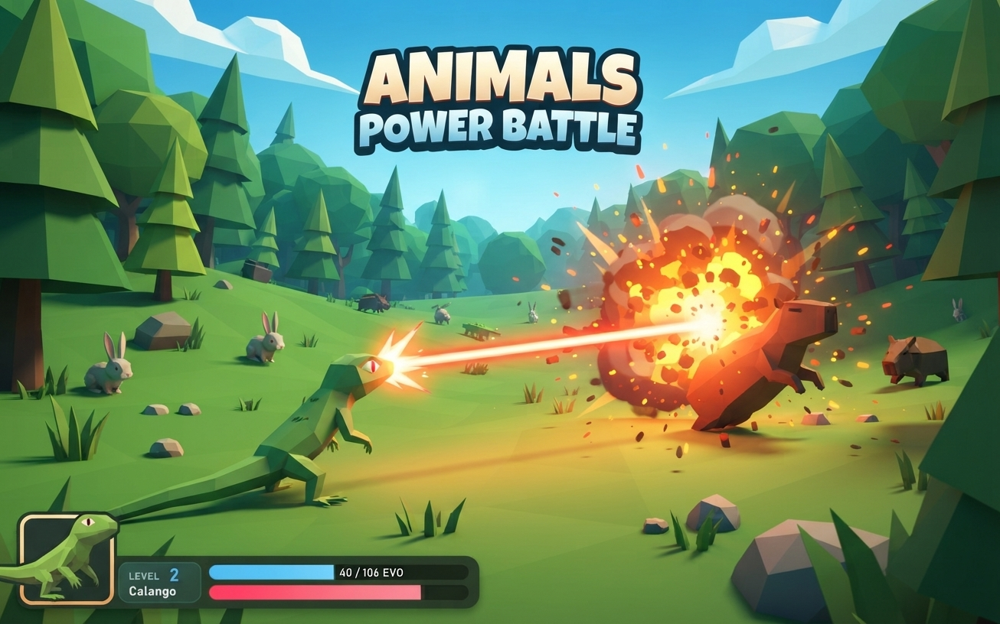
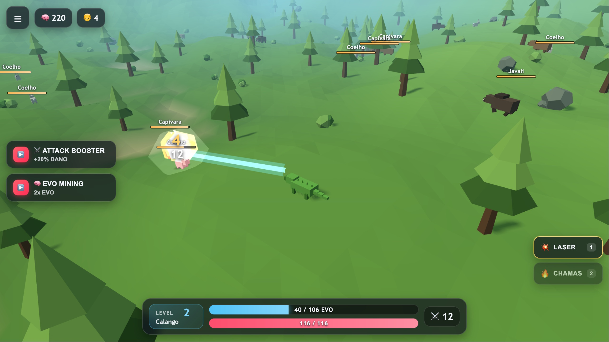
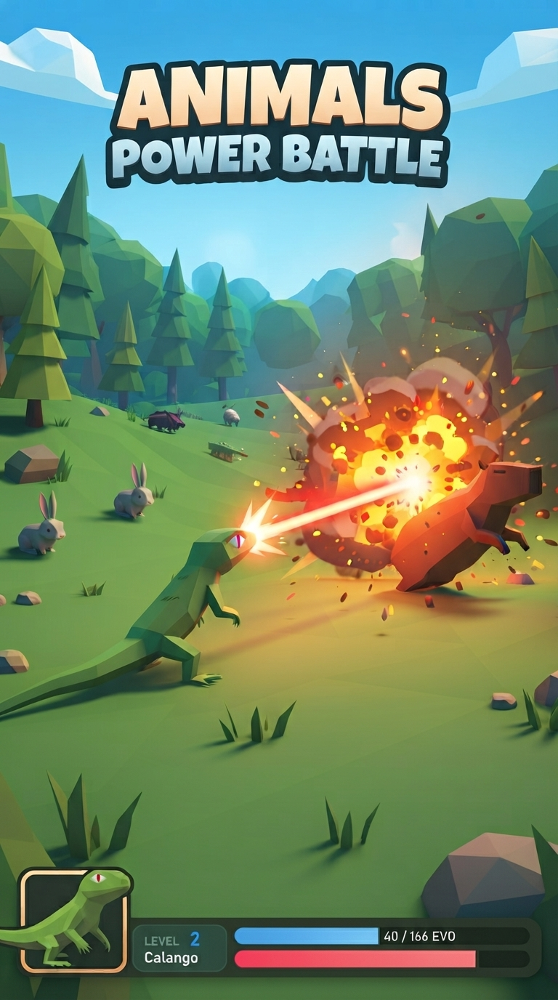
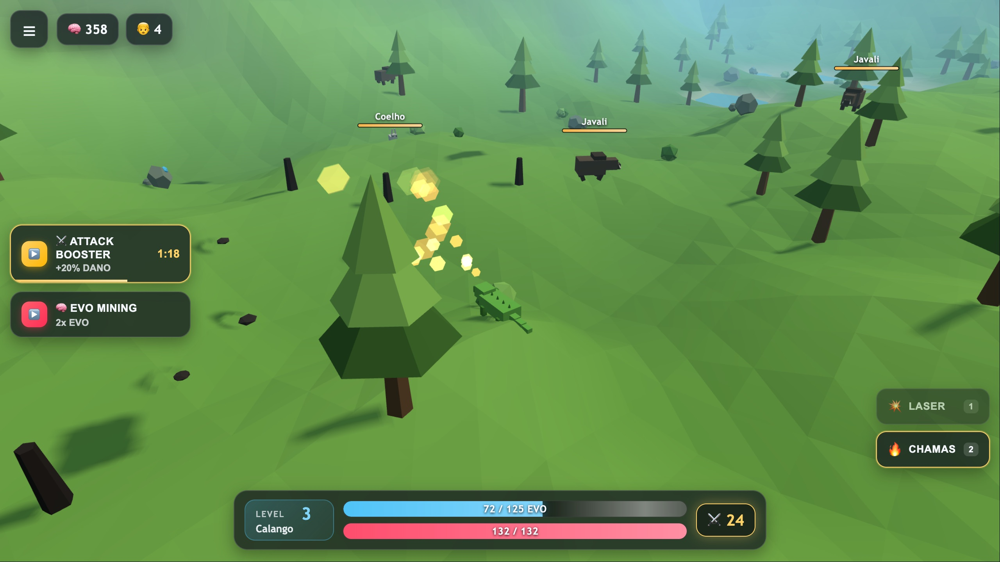
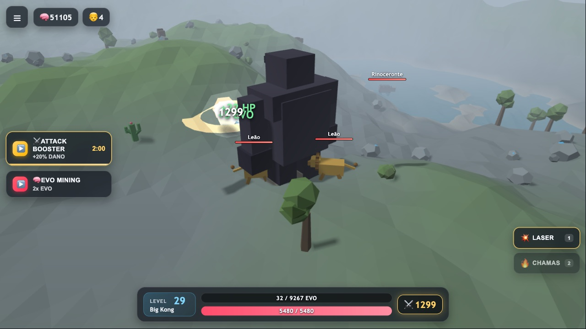
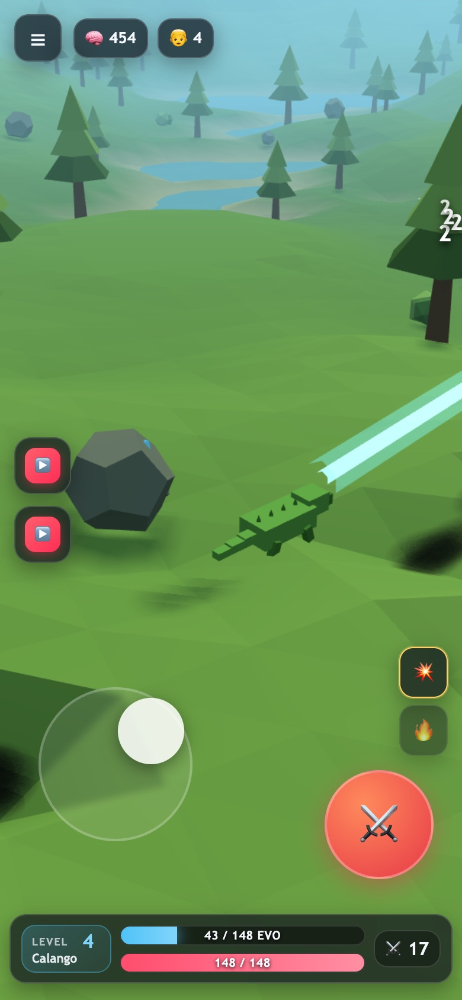
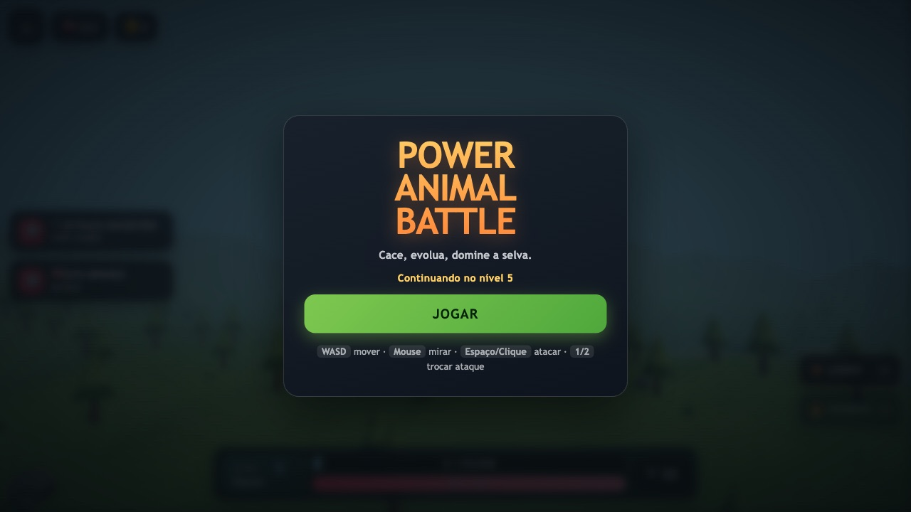

# Animals Power Battle

> Cace, evolua e domine três biomas. Um jogo 3D low-poly que roda direto no
> navegador — sem download, sem plugin, em desktop e celular.

Three.js + Vite. **Zero assets binários**: toda a geometria, os efeitos e até
o áudio são gerados por código. O build inteiro tem ~145 KB gzip.



---

## Um calango. Um laser. Uma capivara.

<table>
<tr>
<td width="58%">



**No jogo de verdade.** O laser trava no alvo mais próximo, explode no impacto
e ainda cava o terreno — até 10 tiros por segundo.

</td>
<td width="42%">



</td>
</tr>
</table>

---

## O jogo

<table>
<tr>
<td width="50%">



**🔥 Chamas** — dano alto e curto alcance. Incendeia a vegetação, e o fogo
se propaga sozinho para as árvores vizinhas.

</td>
<td width="50%">



**🦍 Big Kong, nível 29** — a forma final, cercada de leões e rinocerontes.
ATK 1299, HP 5480.

</td>
</tr>
</table>

<table>
<tr>
<td width="50%">



**📱 Mobile de verdade** — joystick virtual, botão de ataque e troca de arma.
Dá para andar, atirar e girar a câmera com três dedos ao mesmo tempo.

</td>
<td width="50%">



**▶️ Entra e joga** — o progresso fica salvo, então dá para fechar e voltar
depois de onde parou.

</td>
</tr>
</table>

---

## Evolução

Você começa como um **calango** franzino e termina como **Big Kong**:

| Nível | Espécie | HP | ATK |
|---|---|---|---|
| 1 | 🦎 Calango | 100 | 10 |
| 5 | 🦊 Raposa | 165 | 17 |
| 10 | 🐺 Lobo | 260 | 28 |
| 16 | 🐆 Pantera | 400 | 44 |
| 22 | 🐻 Urso | 640 | 66 |
| 28 | 🦍 Big Kong | 1000 | 105 |

E o mundo muda com você: **Floresta** → **Savana** (nível 10) →
**Terras Rochosas** (nível 22).

## Rodar

```bash
npm install
npm run dev      # http://localhost:5173
npm run build    # gera dist/
npm run preview  # serve o build de produção
```

## Controles

| | Desktop | Mobile |
|---|---|---|
| Mover | `WASD` / setas | joystick (metade esquerda da tela) |
| Mirar / girar câmera | mouse | arrastar na metade direita |
| Atacar | `Espaço` ou clique | botão ⚔️ |
| Trocar ataque | `1`/`2` ou `Q`/`E` | botões 💥 / 🔥 |

## Ataques

- **Laser** — alcance longo (clampado pela distância visível), dano médio,
  explode no impacto, causa dano em área e **abre cratera no terreno**.
- **Chamas** — cone curto, dano alto por tick, **incendeia** plantas; o fogo
  consome o prop e se propaga para vizinhos inflamáveis (teto de 22 focos).

## Progressão

Calango (1) → Raposa (5) → Lobo (10) → Pantera (16) → Urso (22) → Big Kong (28).
Biomas trocam nos níveis 10 (Savana) e 22 (Terras Rochosas), com interstitial.

## Progresso salvo

O progresso fica em `localStorage` e sobrevive a fechar o navegador.

- **Ao morrer:** perde 1 nível (nunca abaixo de 1), mantém o resto
- **F5 / fechar aba:** volta exatamente de onde parou
- **Menu → APAGAR PROGRESSO:** recomeça do zero (pede confirmação)

## Monetização

`src/monetization/AdManager.js` é agnóstico de SDK:

```js
AdManager.showRewardedAd(onSuccess, onFail)   // boosters
AdManager.showInterstitialAd(onComplete)      // game over / troca de bioma
```

Em dev usa `MockAdapter` (anúncio simulado com contagem regressiva).
Para publicar, inclua o `<script>` do SDK no `index.html` e **descomente** as
chamadas no adapter correspondente em `src/monetization/adapters/`:

- `PokiAdapter.js` — `PokiSDK.rewardedBreak()`
- `CrazyGamesAdapter.js` — `SDK.ad.requestAd('rewarded')`
- `YouTubePlayablesAdapter.js` — `ytgame.ads.*`

A detecção é automática; para testar um adapter localmente use `?sdk=poki`.
O jogo pausa (loop + áudio) durante qualquer anúncio, como as plataformas exigem.

## Ajustes rápidos

- `src/config/balance.js` — curvas de XP/HP/ATK, boosters, limites de spawn.
- `src/config/palette.js` — cache de materiais compartilhados.
- `src/world/biomes/*.js` — cores, relevo, densidade de props, tabela de mobs.

> **Atenção ao mexer em `biome.terrain.amplitude`:** as cores do terreno são
> relativas à amplitude. Depois de alterar, confira a proporção de areia/água
> (alvo: ~10% areia, <5% água).

## Estrutura

```
src/
├─ core/          loop, cena, câmera, input, estados
├─ world/         terreno, biomas, props, água, povoamento
├─ entities/      player, 6 espécies, 6 mobs (1 arquivo cada), barras de vida
├─ combat/        dano/EVO, números flutuantes, 2 ataques
├─ fx/            explosão, fogo, impacto (todos pooled)
├─ physics/       grid de colisão + raymarch
├─ ui/            HUD, joystick, boosters, overlays
├─ audio/         Web Audio sintético (sem arquivos de som)
└─ monetization/  AdManager + 4 adapters
```

## Notas de performance

O shadow map é estático (só re-renderiza quando o sol se move) e os materiais
são compartilhados por cor. Para medir FPS, use um Chrome **sem automação**:
```js
game.sampleFps(120); // depois: game._fpsResult
```
Medições feitas através de DevTools/CDP não são confiáveis para este projeto.
