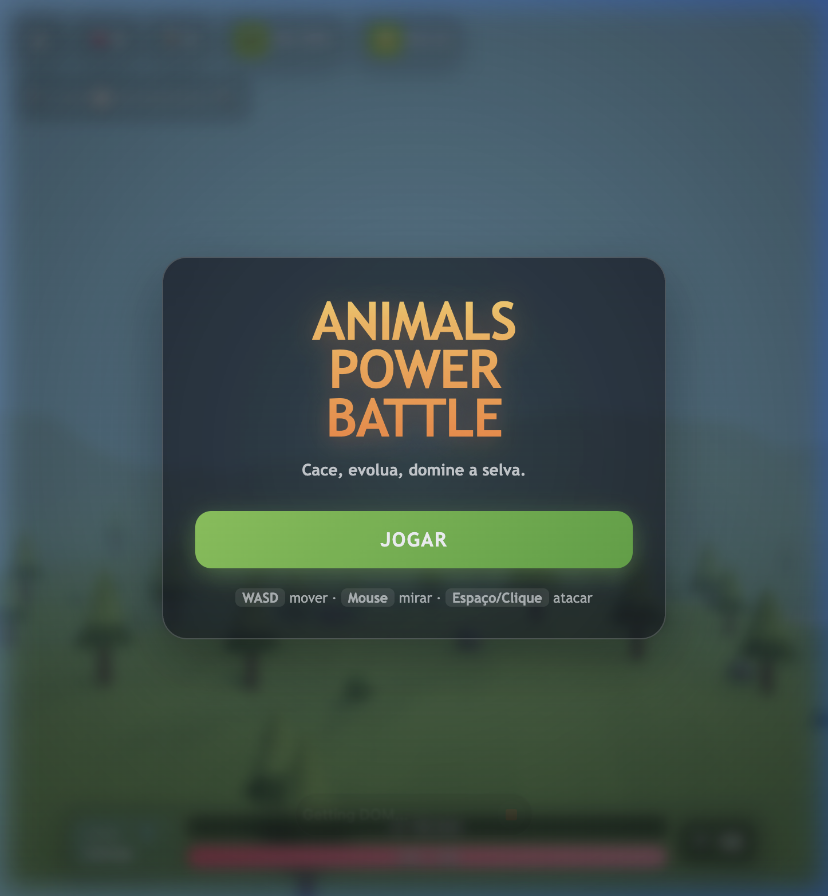
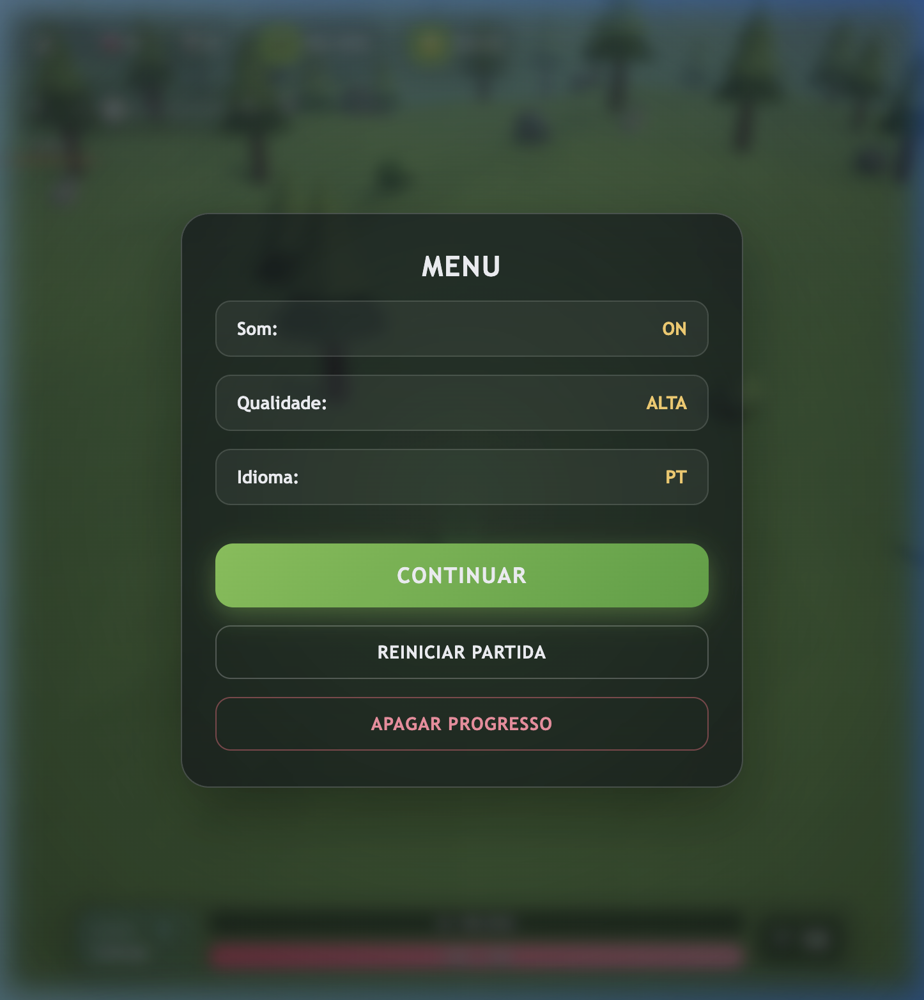
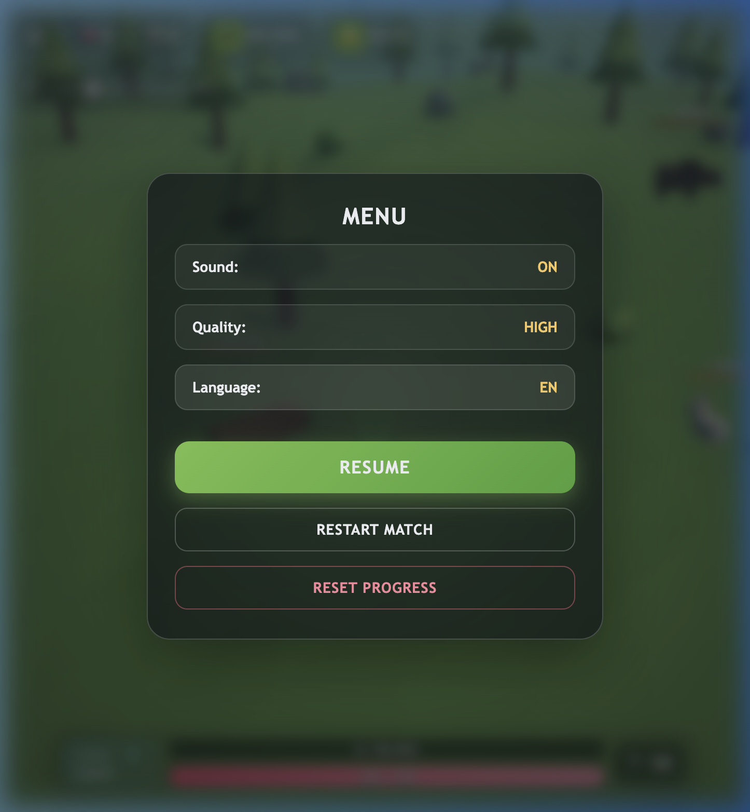
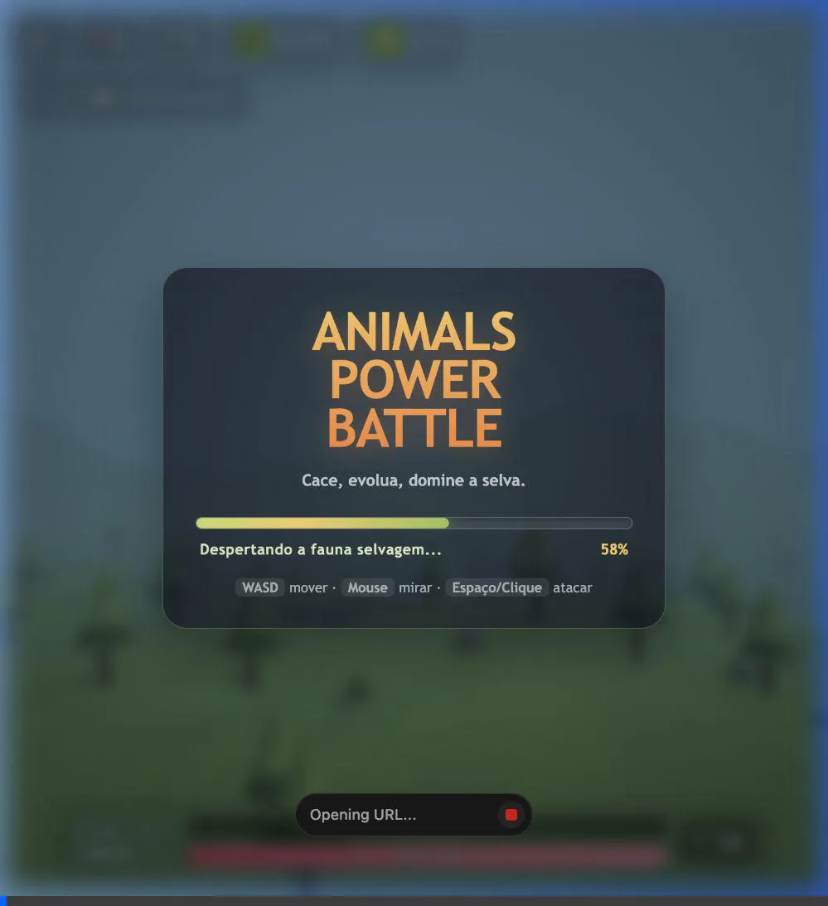

# Walkthrough: Sistema de Tradução Leve (i18n)

Implementação concluída do sistema de internacionalização com a sintaxe solicitada diretamente no corpo dos elementos HTML (`<p class="tagline">t('start.tagline')</p>`), zero dependências externas e troca dinâmica de idioma em tempo real.

---

## O que foi implementado

### 1. Dicionário de Traduções
* Criado [`locales.js`](../../src/i18n/locales.js) contendo todas as mensagens do jogo em **Português (`pt`)** e **Inglês (`en`)**:
  * Telas Iniciais e Overlays (Tagline, Loading, Instruções de controles para desktop e mobile, Botão Jogar).
  * Menu de Pausa (Som, Qualidade, Idioma, Continuar, Reiniciar, Apagar Progresso com confirmação).
  * Game Over, Estatísticas e Botão Tentar Novamente.
  * Tela de Evolução e Níveis.
  * Biomas e descrições.
  * Espécies (`Calango` / `Lizard`, `Raposa` / `Fox`, `Lobo` / `Wolf`, etc.).
  * Armas e Boosters.

### 2. Motor de Tradução (`i18n`)
* Criado [`index.js`](../../src/i18n/index.js):
  * **Detecção Automática**: Lê `localStorage` (`animal_battle_lang`) com fallback inteligente para o navegador (`navigator.language.startsWith('pt') ? 'pt' : 'en'`).
  * **Sintaxe Inline no HTML**: Um `TreeWalker` percorre os nós de texto buscando padrões `t('chave')` e atributos (`title`, `aria-label`). Ele preserva o modelo bruto internamente, permitindo alternar idiomas em tempo real sem recarregar a página.
  * **Suporte a HTML**: Elementos com tags formatadas (como `<b>WASD</b>`) têm seu `innerHTML` interpretado com fidelidade.
  * **Interpolação de Variáveis**: Função `t('start.progressHint', { level: 5 })`.
  * **Reatividade**: Disparo de eventos `onLanguageChange` para atualizar textos do HUD e componentes dinâmicos.

### 3. Integração na Interface
* Atualizado [`index.html`](../../index.html) substituindo os textos estáticos pela sintaxe declarativa solicitada:
  ```html
  <p class="tagline">t('start.tagline')</p>
  <button class="primary-btn ready-btn hidden" id="btn-play">t('start.play')</button>
  <h2 class="gameover-title">t('gameover.title')</h2>
  <button class="menu-row" id="btn-lang">t('menu.language') <b id="lang-state">PT</b></button>
  ```
* Atualizados os componentes de UI para reagir à troca de idioma:
  * [`Overlays.js`](../../src/ui/Overlays.js): Loading animado, confirmação de exclusão e alternância no menu.
  * [`HUD.js`](../../src/ui/HUD.js): Nome da espécie e limpeza de cache.
  * [`EvolutionScreen.js`](../../src/ui/EvolutionScreen.js): Nome das espécies e rótulos de nível.
  * [`BoosterPanel.js`](../../src/ui/BoosterPanel.js): Rótulos de dano máximo e boosters.
  * [`main.js`](../../src/main.js): Inicialização prévia de `initI18n()` antes de montar o Three.js.

---

## Validação no Navegador

O fluxo completo foi testado e validado em execução real:

1. **Tela Inicial**:
   * A tagline foi renderizada como `"Cace, evolua, domine a selva."`.
   * Nenhuma string bruta `t('...')` ficou visível no DOM.
   * A barra de progresso carregou e exibiu o botão `"JOGAR"`.



2. **Menu de Pausa em Português**:
   * Itens renderizados: `"Som: ON"`, `"Qualidade: ALTA"`, `"Idioma: PT"`, `"CONTINUAR"`, etc.
   * HUD exibindo espécie `"Calango"`.



3. **Troca Instantânea para Inglês**:
   * Ao clicar em `#btn-lang`, toda a interface mudou imediatamente para Inglês sem recarregar a página.
   * Menu: `"Sound: ON"`, `"Quality: HIGH"`, `"Language: EN"`, `"RESUME"`, `"RESTART MATCH"`, `"RESET PROGRESS"`.
   * Espécie no HUD mudou dinamicamente para `"Lizard"`.



4. **Gravação da Sessão de Teste**:
   * A gravação em vídeo das ações do teste no navegador está disponível em:
   
